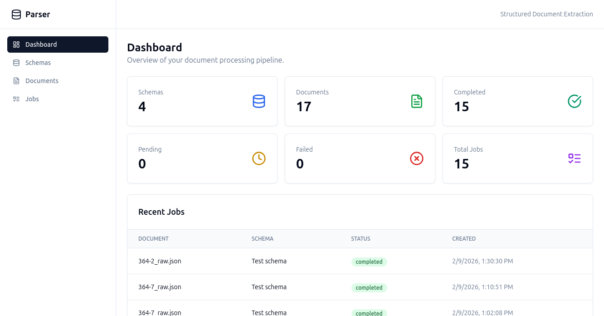
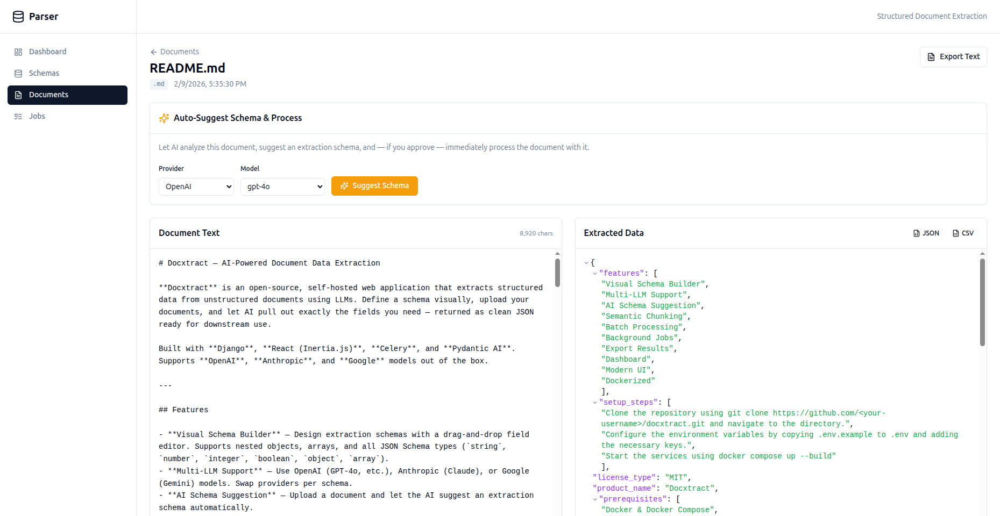

# Docxtract — AI-Powered Document Data Extraction

**Docxtract** is an open-source, self-hosted web application that extracts structured data from unstructured documents using LLMs. Define a schema visually, upload your documents, and let AI pull out exactly the fields you need — returned as clean JSON ready for downstream use.

Built with **Django**, **React (Inertia.js)**, **Celery**, and **Pydantic AI**. Supports **OpenAI**, **Anthropic**, and **Google** models out of the box.

---

## Features

- **Visual Schema Builder** — Design extraction schemas with a drag-and-drop field editor. Supports nested objects, arrays, and all JSON Schema types (`string`, `number`, `integer`, `boolean`, `object`, `array`).
- **Multi-LLM Support** — Use OpenAI (GPT-4o, etc.), Anthropic (Claude), or Google (Gemini) models. Swap providers per schema.
- **AI Schema Suggestion** — Upload a document and let the AI suggest an extraction schema automatically.
- **Semantic Chunking** — Large documents (>50K chars) are automatically split into overlapping chunks and processed iteratively, so you're never limited by context windows.
- **Batch Processing** — Process multiple documents against the same schema in one go.
- **Background Jobs** — All extraction runs asynchronously via Celery with automatic retries, exponential backoff, and real-time status tracking.
- **Export Results** — Download extracted data as JSON or CSV.
- **Dashboard** — At-a-glance stats for schemas, documents, and jobs (pending, completed, failed).
- **Modern UI** — React + Tailwind CSS + shadcn/ui components, served via Inertia.js for a SPA-like experience without building a separate API.
- **Dockerized** — Full `docker-compose` setup with PostgreSQL, Django, Celery worker, and Vite dev server.

---

## Screenshot


---


---

## Architecture

```
┌────────────┐  Inertia  ┌──────────────┐
│  React UI  │◄──────────►│  Django      │
│  (Vite)    │            │  Views       │
└────────────┘            └──────┬───────┘
                                 │
                    ┌────────────┼────────────┐
                    │            │            │
              ┌─────▼────┐ ┌────▼─────┐ ┌────▼──────┐
              │ Postgres │ │  Celery  │ │ Pydantic  │
              │   (DB +  │ │  Worker  │ │    AI     │
              │  Broker) │ └────┬─────┘ │  Agents   │
              └──────────┘      │       └─────┬─────┘
                                │             │
                                └──────┬──────┘
                                       │
                              ┌────────▼────────┐
                              │  LLM Provider   │
                              │ OpenAI/Anthropic│
                              │    /Google      │
                              └─────────────────┘
```

---

## Quick Start

### Prerequisites

- **Docker** & **Docker Compose** (recommended), _or_
- Python 3.12+, PostgreSQL 16+, and [Bun](https://bun.sh/) for local development

### 1. Clone the repository

```bash
git clone https://github.com/<your-username>/docxtract.git
cd docxtract
```

### 2. Configure environment variables

```bash
cp .env.example .env
```

Edit `.env` and add your LLM API keys:

```dotenv
DJANGO_SECRET_KEY=change-me-to-a-random-string
DJANGO_DEBUG=True

# Database (defaults work with docker-compose)
DB_NAME=parser_db
DB_USER=postgres
DB_PASSWORD=postgres
DB_HOST=db
DB_PORT=5432

# LLM Providers (add at least one)
OPENAI_API_KEY=sk-...
OPENAI_BASE_URL=              # optional, for OpenAI-compatible APIs
ANTHROPIC_API_KEY=sk-ant-...
GOOGLE_API_KEY=AIza...
```

### 3. Start with Docker Compose

```bash
docker compose up --build
```

This starts four services:

| Service    | URL / Info                |
|------------|--------------------------|
| **Web**    | http://localhost:8000     |
| **Frontend** | http://localhost:5173 (Vite dev server) |
| **Celery** | Background worker        |
| **Postgres** | Port 5432              |

Open **http://localhost:8000** in your browser.

---

## Local Development (without Docker)

### Backend

```bash
python -m venv .venv
source .venv/bin/activate
pip install -r requirements.txt

# Make sure PostgreSQL is running and the database exists
python manage.py migrate
python manage.py runserver
```

### Celery Worker

```bash
celery -A config worker -l info --concurrency=2
```

### Frontend

```bash
cd frontend
bun install
bun run dev
```

---

## Usage

### 1. Create a Schema

Navigate to **Schemas → Create**. Use the visual builder to define fields:

- Give each field a **name**, **type**, and **description** (the description guides the AI).
- Nest fields inside `object` or `array` types.
- Choose your LLM **provider** and **model**.

### 2. Upload Documents

Go to **Documents → Upload**. Supported formats: `.txt`, `.md`, and other plain-text files (up to 50 MB).

### 3. Process

From a document's page, select a schema and click **Process**. The job runs in the background — status updates in real time.

### 4. View & Export Results

Once completed, view the extracted JSON on the job detail page. Export as **JSON** or **CSV**.

### AI Schema Suggestion

Don't want to build a schema from scratch? Upload a document and click **Suggest Schema** — the AI will analyze the document and propose a schema you can review and adopt.

---

## Project Structure

```
├── config/              # Django project settings, urls, celery config
├── documents/           # Main Django app
│   ├── models.py        # ExtractionSchema, Document, ProcessingJob
│   ├── services.py      # Pydantic AI agents, chunking, schema conversion
│   ├── tasks.py         # Celery tasks with retry logic
│   ├── views.py         # Inertia views (server-side rendered props)
│   └── urls.py          # URL routing
├── frontend/            # React + TypeScript + Vite
│   └── src/
│       ├── pages/       # Inertia page components
│       ├── components/  # Schema builder, JSON viewer
│       ├── layouts/     # App shell layout
│       └── types/       # TypeScript interfaces
├── templates/           # Django base template (Inertia root)
├── docker-compose.yml   # Multi-service Docker setup
├── Dockerfile           # Python 3.12 slim image
├── manage.py
└── requirements.txt
```

---

## Tech Stack

| Layer      | Technology                                   |
|------------|----------------------------------------------|
| Backend    | Django 4.2+, Python 3.12                     |
| Frontend   | React 18, TypeScript, Vite, Tailwind CSS     |
| Bridge     | Inertia.js (django-inertia + @inertiajs/react) |
| AI/LLM     | Pydantic AI (OpenAI, Anthropic, Google)      |
| Task Queue | Celery (PostgreSQL as broker via SQLAlchemy) |
| Database   | PostgreSQL 16                                |
| UI Kit     | shadcn/ui (Radix UI primitives)              |
| Runtime    | Bun (frontend), Docker                       |

---

## Environment Variables

| Variable             | Description                          | Default            |
|----------------------|--------------------------------------|--------------------|
| `DJANGO_SECRET_KEY`  | Django secret key                    | `change-me-in-production` |
| `DJANGO_DEBUG`       | Enable debug mode                    | `True`             |
| `DJANGO_ALLOWED_HOSTS` | Comma-separated allowed hosts      | `localhost,127.0.0.1` |
| `DB_NAME`            | PostgreSQL database name             | `parser_db`        |
| `DB_USER`            | PostgreSQL user                      | `postgres`         |
| `DB_PASSWORD`        | PostgreSQL password                  | `postgres`         |
| `DB_HOST`            | PostgreSQL host                      | `localhost`        |
| `DB_PORT`            | PostgreSQL port                      | `5432`             |
| `OPENAI_API_KEY`     | OpenAI API key                       | —                  |
| `OPENAI_BASE_URL`    | Custom OpenAI-compatible base URL    | —                  |
| `ANTHROPIC_API_KEY`  | Anthropic API key                    | —                  |
| `GOOGLE_API_KEY`     | Google AI API key                    | —                  |

---

## Contributing

Contributions are welcome! Please open an issue first to discuss what you'd like to change.

1. Fork the repository
2. Create your feature branch (`git checkout -b feature/amazing-feature`)
3. Commit your changes (`git commit -m 'Add amazing feature'`)
4. Push to the branch (`git push origin feature/amazing-feature`)
5. Open a Pull Request

---

## License

This project is licensed under the [MIT License](LICENSE).

---

## Acknowledgements

- [Pydantic AI](https://github.com/pydantic/pydantic-ai) — LLM agent framework
- [Inertia.js](https://inertiajs.com/) — Modern monolith SPA bridge
- [shadcn/ui](https://ui.shadcn.com/) — Beautiful, accessible UI components
- [Django](https://www.djangoproject.com/) — The web framework for perfectionists with deadlines
